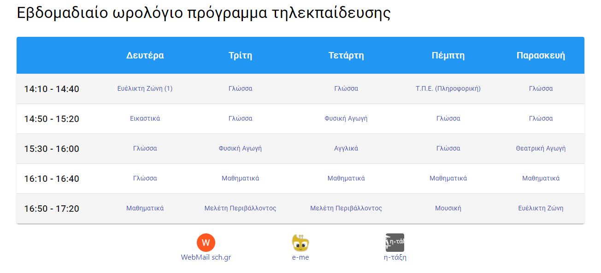

# E-learning weekly schedule

The main purpose of the project is to serve as a landing page. It creates a single page with the weekly lesson plan. You can click on any lesson and the WebEx link will start. I use it by setting it as the default page to load when Chrome starts. 

Here's an example:



Instructions on how to modify this project to suit your needs later on this README.

Feel free to fork this project and modify it if it suits you!

> I'm not a front-end developer. This project is something I did on my "free" time. A lot of things are missing (including tests). I'll try to update it, and possibly add new features.


# Customizing the project to your needs

> I assume that you're familiar with coding.

## Configure schedule

Edit file [src/data/schedule.json](schedule.json). The structure is simple. There's a list of days, and for each day is a list of lessons. Each lesson has a name (it is displayed as a label) and the teacher's WebEx "alias".

> The order of days in the JSON file affects the order of the displayed items.

> Links generated are in the form `https://minedu-primary.webex.com/meet/<teacher username>`. Sorry, hard-coded for now.

You can also add links (if you want) at the bottom of the page. Each item in the `links` array may have the following fields:
- **`text` (required)**: the text to appear for the link. Must be non-empty string, otherwise the link will be skipped.
- **`href` (required)**: the target of the link. Must be non-empty string, otherwise the link will be skipped.
- `image` (optional): an image to appear in the avatar. If not specified, the first non-empty character from `text` is used (uppercased)
- `bgColor` (optional): sets background color for the image. Useful in case the image is transparent.

## Build the project

Simply run

```
npm run build
```

Then you can open build/index.html to see the schedule.

> If you know how, you can host the page at some URL. Perhaps you can also share the URL with other parents of the class.

## (Optional) Configure your browser to open the page by default

- Open `build/index.html` in your browser.
- Copy full path from URL bar.
- Follow browser-specific instructions
    - [Chrome](https://support.google.com/chrome/answer/95314?co=GENIE.Platform%3DDesktop&hl=en&oco=0)
    - [Firefox](https://support.mozilla.org/en-US/kb/how-to-set-the-home-page) - you can configure the HTML as web page.
    - Internet explorer - yeah, right.

# Developing 

Τhis project was bootstrapped with [Create React App](https://github.com/facebook/create-react-app).

## Available Scripts

In the project directory, you can run:

### `npm start`

Runs the app in the development mode.\
Open [http://localhost:3000](http://localhost:3000) to view it in the browser.

The page will reload if you make edits.\
You will also see any lint errors in the console.

### `npm test`

Launches the test runner in the interactive watch mode.\
See the section about [running tests](https://facebook.github.io/create-react-app/docs/running-tests) for more information.

### `npm run build`

Builds the app for production to the `build` folder.\
It correctly bundles React in production mode and optimizes the build for the best performance.

The build is minified and the filenames include the hashes.\
Your app is ready to be deployed!

See the section about [deployment](https://facebook.github.io/create-react-app/docs/deployment) for more information.
